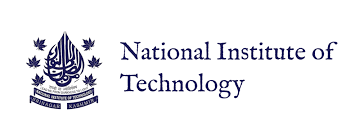

## About Me

I am a **Ph.D. student in Computer Science at the University of California, San Diego (UCSD)** advised by [Prof. Manmohan Chandraker](https://cseweb.ucsd.edu/~mkchandraker/), where my research focuses on the intersection of Multi-modal Learning, Generative AI and Embodied Intelligence. I also hold a research appointment at the Mohamed Bin Zayed University of Artificial Intelligence (MBZUAI).

Before joining UCSD, I earned my **Master’s degree in Machine Learning** at MBZUAI where I was part of the [Intelligent Visual Analytics Lab (IVAL)](https://www.ival-mbzuai.com/), advised by [Prof. Salman Khan](https://salman-h-khan.github.io/) and co-advised by [Prof. Fahad Khan](https://sites.google.com/view/fahadkhans/home). I was also fortunate to be advised and mentored by [Prof. Muzammal Naseer](https://muzammal-naseer.netlify.app/). I also spent time as a **visiting student** with [Prof. Peter Wonka](https://peterwonka.net/) at **KAUST**.

<!---
I received my undergraduate degree in **Electronics and Communication Engineering** with a **minor in Computer Science** from the **National Institute of Technology (NIT) Srinagar**. Before transitioning to academia, I worked as a **Machine Learning Engineer** at the Harman Research Division of **Samsung**.

I am currently a Research Associate at [Mohamed Bin Zayed University of Artificial Intelligence (MBZUAI)](http://www.mbzuai.ac.ae) and have recently obtained my Masters degree in machine learning from the same institution. At MBZUAI, I am affliated with the [Intelligent Visual Analytics Lab (IVAL)](https://www.ival-mbzuai.com/) where I am primarily advised by [Dr. Salman Khan](https://salman-h-khan.github.io/) and have a close collaboration with [Dr. Muzammal Naseer](https://muzammal-naseer.netlify.app/). My secondary advisor is [Dr. Fahad Khan](https://sites.google.com/view/fahadkhans/home). I have also worked as a visiting student with [Professor Peter Wonka](https://peterwonka.net/) at King Abdullah University of Science and Technology (KAUST). 

I received my undergraduate degree in Electronics and Communication Engineering with a minor in Computer Science from the [National Institute of Technology (NIT) Srinagar, India](https://nitsri.ac.in/). After graduation, I worked as a Machine Learning engineer at Harman Research Division of [Samsung](https://www.harman.com/India) before transitioning into academia in 2021 and joining MBZUAI as a Research Assistant under [Dr. Mohammad Yaqub](https://scholar.google.co.uk/citations?user=9dfn5GkAAAAJ&hl=en)
-->

    

        
        
University of California, San Diego (2025-Present)

    

    

        
        
MBZUAI (2021-Present)

    

    

        
        
KAUST (2023)

    

    

        
        
Samsung (2018-2021)

    

    

        
       
NIT Srinagar (2014-2018)

    

## Research Interests

My research focuses on developing **multimodal AI systems** that seamlessly integrate **reasoning**, **generative modeling**, and **embodied intelligence**.

## News
- **[September. 2025]** Embarked my PhD in Computer Science at the **University of California, San Diego (UCSD)**.
- **[September. 2025]** Achieved **2nd place** in research track at **UC Berkeley's AgentX challenge**.
- **[June. 2025]** Our paper titled "Aurelia: Test-time Reasoning Distillation in Audio-Visual LLMs" is accepted at **ICCV 2025**.
- **[March. 2025]** Our paper titled "VideoGLaMM: A Large Multimodal Model for Pixel-Level Visual Grounding in Videos" got accepted at **CVPR 2025**.
- **[Jan. 2025]** Our paper titled "VANE-Bench: Video Anomaly Evaluation Benchmark for Conversational LMMs" got accepted at **NAACL 2025**.
- **[Nov. 2024]** One paper accepted at **COLING 2025**.
- **[Oct. 2024]** One paper accepted at **IEEE/CVF WACV 2025**.
- **[June. 2024]** Our paper "MedContext: Learning Contextual Cues for Efficient Volumetric Medical Segmentation" got accepted at **MICCAI 2024**.
- **[June. 2024]** One paper accepted at **IEEE ICIP 2024**.
- **[March. 2024]** Awarded **ICLR 2024 Travel Grant**.
- **[Jan. 2024]** Our paper "LLM Blueprint: Enabling Text-to-Image Generation with Complex and Detailed Prompts" got accepted at **ICLR 2024**.
- **[Oct. 2023]** Awarded **NeurIPS 2023 Travel Grant**.
- **[Sept. 2023]** Our paper "Align your Prompts: Test-Time Prompting with Distribution Alignment for Zero-Shot Generalization" got accepted at **NeurIPS 2023**.
- **[June. 2023]** Joined Visual Computing Center (VCC) at [KAUST](https://cemse.kaust.edu.sa/vcc) as a Visiting Student under [Professor Peter Wonka](https://peterwonka.net/).
- **[Jan. 2023]** Our **US patent** about training Vision Transformers on small-scale datasets got approved for filing.
  
<!--- - **[Sep. 2022]** I started  working with [Dr. Salman](https://salman-h-khan.github.io/) as a part of [Intelligent Visual Analytics Lab (IVAL)](https://www.ival-mbzuai.com/).
- **[Sep. 2022]** I joined [MBZUAI](http://www.mbzuai.ac.ae) as a grad student in Machine Learning with full scholarship.
- **[Oct. 2022]** Our paper about training Vision Transformers on small-scale datasets got accepted to **BMVC 2022**.
- **[Oct. 2021]** I joined [BiomedIA Lab](https://mbzuai-biomedia.com/biomedia/) at [MBZUAI](http://www.mbzuai.ac.ae) as a Research Assistant.
- **[March. 2021]** I started as a part-time Predoctoral fellow at [Fatima Fellowship](https://www.fatimafellowship.com/) working under [Dr. Abubakr Abid](https://abidlabs.github.io/).
- **[Oct. 2018]** I joined as a Machine Learning Engineer at [Harman International Inc. (Samsung)](https://www.harman.com/India).
- **[July. 2018]** Our paper about supervised methodology for disguised facial recognition in wild got accepted to **ACM ICRCV** 2018.
- **[August. 2018]** Our paper about disguised facial recognition got accepted to **IEEE ICSIP** 2018.
- **[June. 2018]** I completed my undergraduate studies in Electronics and Communications Engineering from the [National Institute of Technology (NIT) Srinagar](https://nitsri.ac.in/).
- **[Dec. 2017]** I joined as a Research Intern in [Computational Intelligence and UAV Lab](https://sites.google.com/site/compintellab/) at the [Indian Institute of Science, Bangalore](https://iisc.ac.in/) -->




